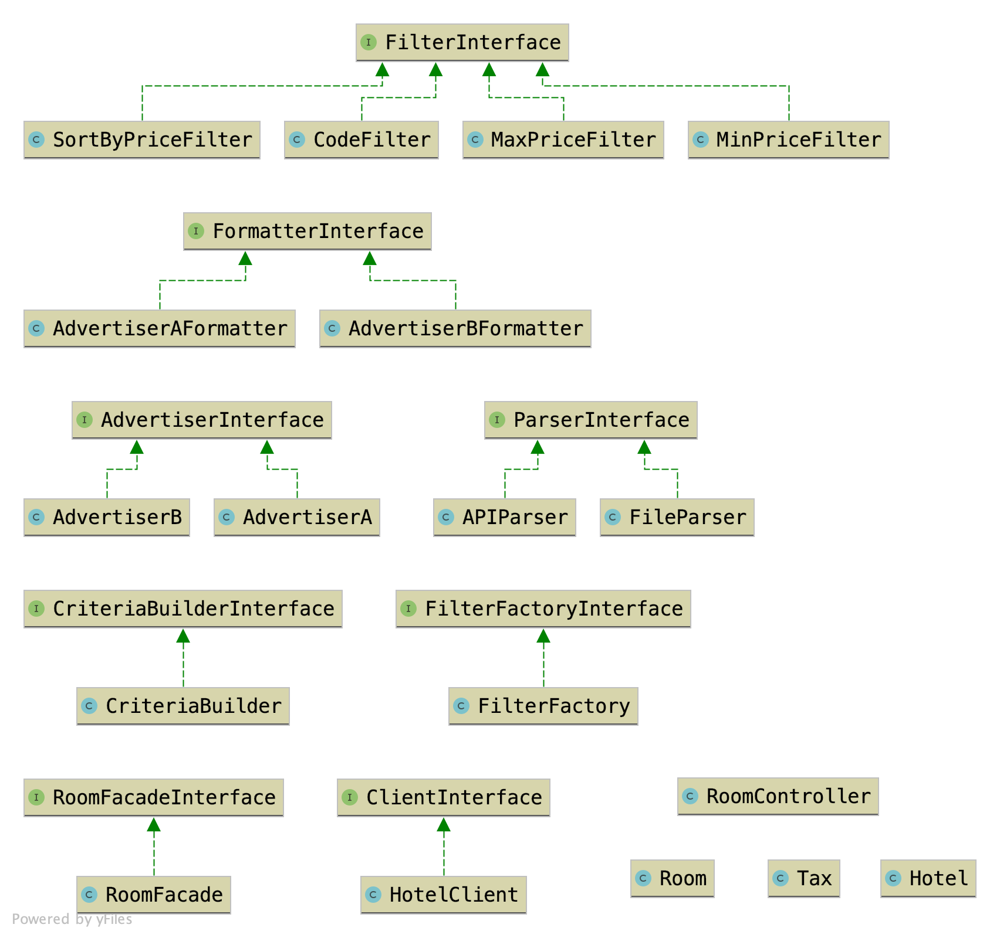

### Class diagram



### Efficiency of parsing streams/files

Following table demonstrates a concept of the difference:

| # | String items in memory at a time	 | Decoded PHP items in memory at a time | Total |
| :---         |     :---:      |          ---: | ---: |
| json_decode   | 10000 | 10000 | 20000 |
| JsonMachine::fromStream    | 1       | 1      | 2 |

This means, that `Streaming` is constantly efficient for any size of processed JSON. 100 GB no problem.


## End point to search in rooms
- A REST API application to get transactions from multiple provider with criteria

- GET `http://localhost:8001/api/rooms`
- Response 
```json
{
  "rooms": {
    "11": {
      "code": "LUX-ROM",
      "name": "Luxury Room",
      "net_price": "177.00",
      "total_price": "199.00",
      "taxes": [],
      "hotel": {
        "name": "Hotel C",
        "stars": 5,
        "rooms": null
      }
    },
    "10": {
      "code": "FUBOD",
      "name": "FULL BOARD",
      "net_price": "165.00",
      "total_price": "180.00",
      "taxes": [],
      "hotel": {
        "name": "Hotel C",
        "stars": 5,
        "rooms": null
      }
    }
  }
}
```

##### Criteria/Filters Examples:

- example `http://localhost:8001/api/rooms?sortByPrice=asc&maxPrice=160&minPrice=150`
- minPrice `/api/rooms?minPrice=150` requirements=`"\d+"`
- maxPrice `/api/rooms?minPrice=167` requirements=`"\d+"`
- sortByPrice `/api/rooms?sortByPrice=asc` requirements=`"[a-z]+"`
- code `/api/rooms?code=FUBOD` requirements=`"[a-z]+"`


### Installation
- Run `docker-compose up -d --build`
- Run `docker-compose run php bin/console rabbitmq:consumer send_notifications`


### Running the tests

- Run `docker exec php-container php bin/phpunit`


### Built With

* [PHP7.4](http://php.net)
* [Symfony5](http://www.symfony.com) 
