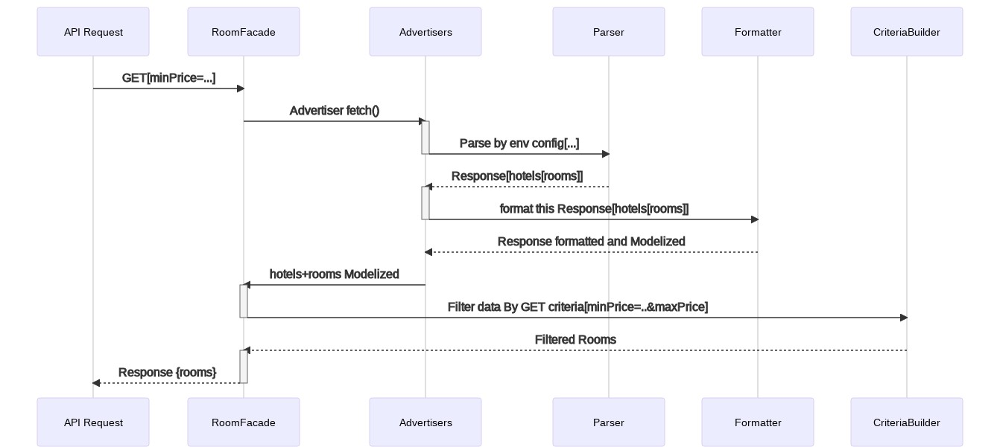

### Sequence diagram



## End point to search in rooms
- A REST API application to parse hotels rooms from multiple provider/advertiser with criteria

- GET `http://localhost:8001/api/rooms`
- Response 
```json
{
  "rooms": {
    "11": {
      "code": "LUX-ROM",
      "name": "Luxury Room",
      "net_price": "177.00",
      "total_price": "199.00",
      "taxes": [],
      "hotel": {
        "name": "Hotel C",
        "stars": 5,
        "rooms": null
      }
    },
    "10": {
      "code": "FUBOD",
      "name": "FULL BOARD",
      "net_price": "165.00",
      "total_price": "180.00",
      "taxes": [],
      "hotel": {
        "name": "Hotel C",
        "stars": 5,
        "rooms": null
      }
    }
  }
}
```

### Assumptions:
- I set timeout for each API request to `.8` to keep my service live.
- Relayed on filesystem `s1-response.json` and `s2-response.json` in case the APIs down or exceed the timeout limit, so the system can switch between fetching the data from the APIs or filesystem on runtime based on APIs' availabilities and timeout limit constrains.
- I used [Symfony Service Tag](https://symfony.com/doc/current/service_container/tags.html) to automatically inject advertisers. But if we have a lot of advertisers we can list them in DB.

##### Criteria/Filters Examples:

- example `http://localhost:8001/api/rooms?sortByPrice=asc&maxPrice=160&minPrice=150`
- minPrice `/api/rooms?minPrice=150` requirements=`"\d+"`
- maxPrice `/api/rooms?minPrice=167` requirements=`"\d+"`
- sortByPrice `/api/rooms?sortByPrice=asc` requirements=`"[a-z]+"`
- code `/api/rooms?code=FUBOD` requirements=`"[a-z]+"`

### Installation
- Run `make build`

### Running the tests
- Run `make test`

### Built With

* [PHP7.4](http://php.net)
* [Symfony5](http://www.symfony.com) 
